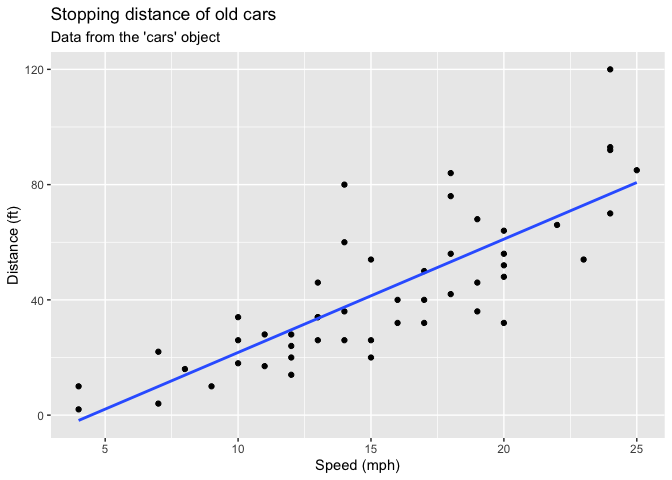
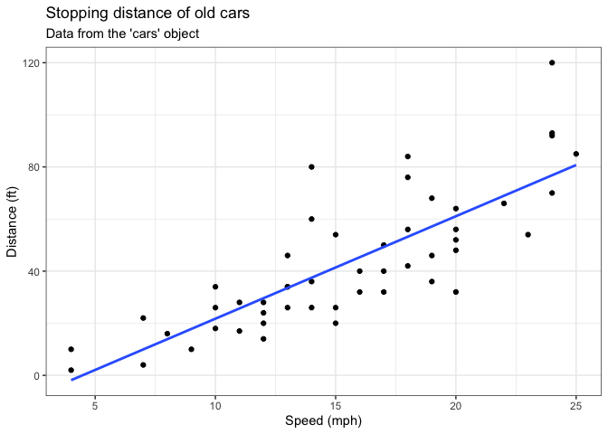
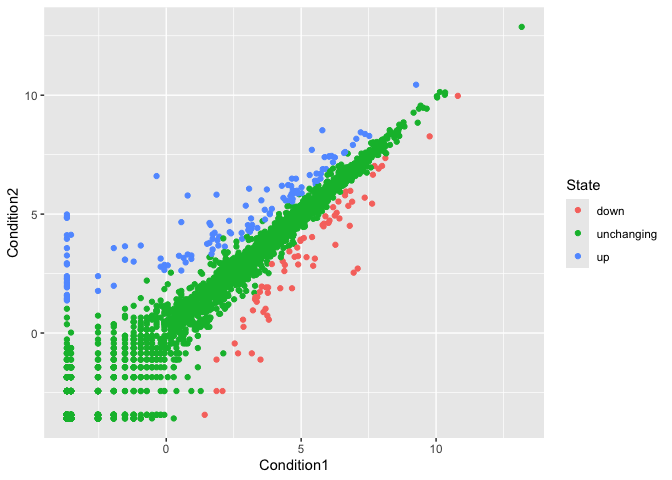
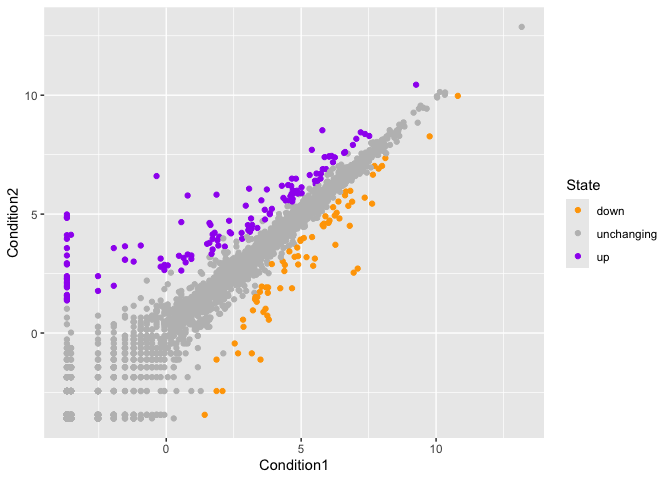
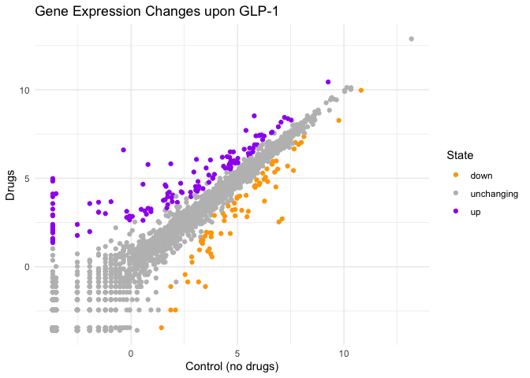

# Class 5: Data Viz with ggplot
Jacob Hizon (PID: A17776679)

## Background

There are lot’s of ways to make figures in R. These include so-called
“base R” graphics (e.g. `plot()`) and tones of add-on packages like
**ggplot2**

For example here we make the same plot with both:

``` r
head(cars)
```

      speed dist
    1     4    2
    2     4   10
    3     7    4
    4     7   22
    5     8   16
    6     9   10

``` r
plot(cars)
```


First I need to install the package with the command
`install.packages()`.

> **N.B.** We never run an install cmd in a quarto code chunk or we will
> end up re-installing packages many many times - which is not what we
> want!

Every time we want to use one of these “add-on” packages we need to load
it up in R with the `library()` function:

``` r
library(ggplot2)
```

``` r
ggplot(cars)
```


Every ggplot needs at least 3 things:

- The **data**, the stuff you want plotted
- The **aes**thitics, how the data map to the plot
- The **geom**etry, the type of plot

``` r
ggplot(cars) + 
  aes(x = speed, y = dist) +
  geom_point()
```


Add a line to better show relationship between speed and dist

``` r
p <- ggplot(cars) + 
  aes(x = speed, y = dist) +
  geom_point() +
  geom_smooth(method="lm", se=FALSE) +
  labs(title = "Stopping distance of old cars",
       subtitle = "Data from the 'cars' object",
       x = "Speed (mph)",
       y = "Distance (ft)")
```

``` r
p
```

    `geom_smooth()` using formula = 'y ~ x'



``` r
p + theme_bw()
```

    `geom_smooth()` using formula = 'y ~ x'



## Gene expression plot

We can read the input data from the class website

``` r
url <- "https://bioboot.github.io/bimm143_S20/class-material/up_down_expression.txt"
genes <- read.delim(url)
head(genes)
```

            Gene Condition1 Condition2      State
    1      A4GNT -3.6808610 -3.4401355 unchanging
    2       AAAS  4.5479580  4.3864126 unchanging
    3      AASDH  3.7190695  3.4787276 unchanging
    4       AATF  5.0784720  5.0151916 unchanging
    5       AATK  0.4711421  0.5598642 unchanging
    6 AB015752.4 -3.6808610 -3.5921390 unchanging

A first version plot

``` r
ggplot(genes) + 
  aes(Condition1, Condition2) + 
  geom_point()
```


``` r
table( genes$State )
```


          down unchanging         up 
            72       4997        127 

Version 2 let’s color by `State` so we can see the up and down
significant genes compared to all the “unchanging” genes

``` r
ggplot(genes) + 
  aes(Condition1, Condition2, col=State) + 
  geom_point()
```



Version 3 plot, let’s modify the default colors to something we like

``` r
ggplot(genes) + 
  aes(Condition1, Condition2, col=State) + 
  geom_point() + 
  scale_color_manual(
    values=c("orange", "gray", "purple")
  )
```



``` r
ggplot(genes) + 
  aes(Condition1, Condition2, col=State) + 
  geom_point() + 
  scale_color_manual(
    values=c("orange", "gray", "purple")) + 
      labs(x="Control (no drugs)", y="Drugs",
           title = "Gene Expression Changes upon GLP-1") +
      theme_minimal()
```



## Going Further

``` r
# File location online
url <- "https://raw.githubusercontent.com/jennybc/gapminder/master/inst/extdata/gapminder.tsv"

gapminder <- read.delim(url)
```

``` r
head(gapminder, 10)
```

           country continent year lifeExp      pop gdpPercap
    1  Afghanistan      Asia 1952  28.801  8425333  779.4453
    2  Afghanistan      Asia 1957  30.332  9240934  820.8530
    3  Afghanistan      Asia 1962  31.997 10267083  853.1007
    4  Afghanistan      Asia 1967  34.020 11537966  836.1971
    5  Afghanistan      Asia 1972  36.088 13079460  739.9811
    6  Afghanistan      Asia 1977  38.438 14880372  786.1134
    7  Afghanistan      Asia 1982  39.854 12881816  978.0114
    8  Afghanistan      Asia 1987  40.822 13867957  852.3959
    9  Afghanistan      Asia 1992  41.674 16317921  649.3414
    10 Afghanistan      Asia 1997  41.763 22227415  635.3414

``` r
ggplot(gapminder) +
  aes(gdpPercap, lifeExp, col=continent) +
  geom_point(alpha = 0.3)
```


Let’s “facet” (i.e. make a seperate plot) by continent rather than big
hot mess above.

``` r
ggplot(gapminder) +
  aes(gdpPercap, lifeExp, col=continent) +
  geom_point(alpha = 0.3) + 
  facet_wrap(~continent)
```


