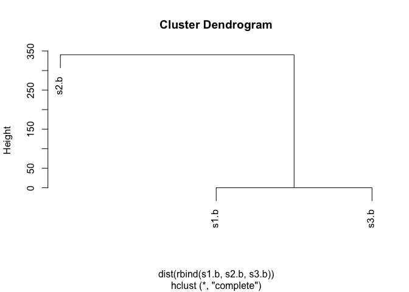
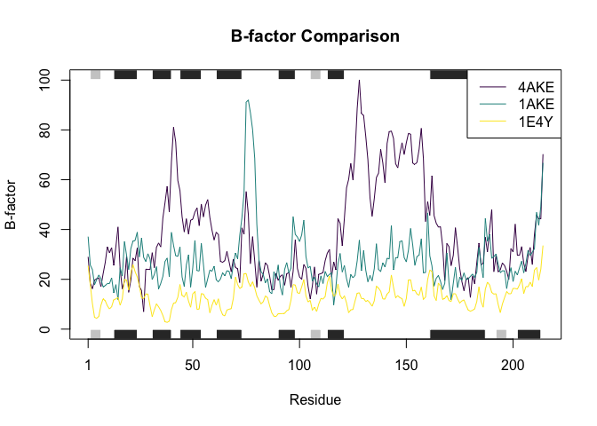
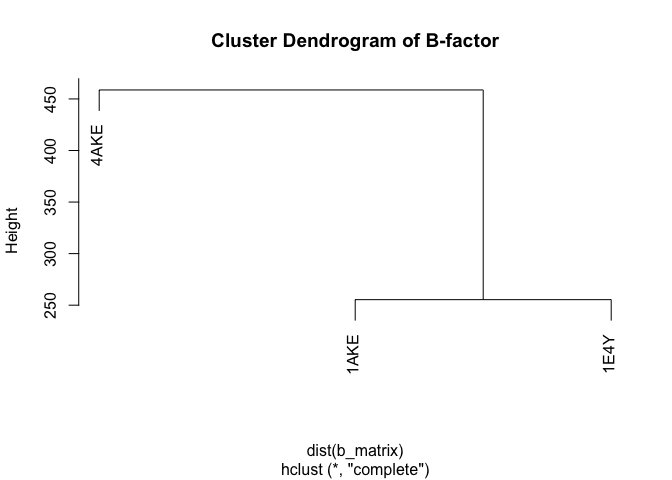

# Class 6 function homework
Jacob Hizon A17776679

Write a function from the supplied code

``` r
# Can you improve this analysis code?
library(bio3d)
s1 <- read.pdb("4AKE") # kinase with drug
```

      Note: Accessing on-line PDB file

``` r
s2 <- read.pdb("1AKE") # kinase no drug
```

      Note: Accessing on-line PDB file
       PDB has ALT records, taking A only, rm.alt=TRUE

``` r
s3 <- read.pdb("1E4Y") # kinase with drug
```

      Note: Accessing on-line PDB file

``` r
s1.chainA <- trim.pdb(s1, chain="A", elety="CA")
s2.chainA <- trim.pdb(s2, chain="A", elety="CA")
s3.chainA <- trim.pdb(s1, chain="A", elety="CA")

s1.b <- s1.chainA$atom$b
s2.b <- s2.chainA$atom$b
s3.b <- s3.chainA$atom$b

plotb3(s1.b, sse=s1.chainA, typ="l", ylab="Bfactor")
```


``` r
plotb3(s2.b, sse=s2.chainA, typ="l", ylab="Bfactor")
```


``` r
plotb3(s3.b, sse=s3.chainA, typ="l", ylab="Bfactor")
```


> Q1. What type of object is returned from the read.pdb() function?

A `read.pdb()` returns a Protein Data Bank (PDB) coordinate file, which
is a list containing data that contains atom coordinates, B-factors,
residue info, sequence, etc. This object is used through the bio3d
package for structural bioinformatics analyses.

``` r
s1
```


     Call:  read.pdb(file = "4AKE")

       Total Models#: 1
         Total Atoms#: 3459,  XYZs#: 10377  Chains#: 2  (values: A B)

         Protein Atoms#: 3312  (residues/Calpha atoms#: 428)
         Nucleic acid Atoms#: 0  (residues/phosphate atoms#: 0)

         Non-protein/nucleic Atoms#: 147  (residues: 147)
         Non-protein/nucleic resid values: [ HOH (147) ]

       Protein sequence:
          MRIILLGAPGAGKGTQAQFIMEKYGIPQISTGDMLRAAVKSGSELGKQAKDIMDAGKLVT
          DELVIALVKERIAQEDCRNGFLLDGFPRTIPQADAMKEAGINVDYVLEFDVPDELIVDRI
          VGRRVHAPSGRVYHVKFNPPKVEGKDDVTGEELTTRKDDQEETVRKRLVEYHQMTAPLIG
          YYSKEAEAGNTKYAKVDGTKPVAEVRADLEKILGMRIILLGAPGA...<cut>...KILG

    + attr: atom, xyz, seqres, helix, sheet,
            calpha, remark, call

> Q2. What does the trim.pdb() function do?

A `trim.pdb()` pulls out a subset of atoms from a pdb object based on a
specified criteria. In this case, it is used to extract only the alpha
carbon atoms (CA) from chain A.

> Q3. What input parameter would turn off the marginal black and grey
> rectangles in the plots and what do they represent in this case?

You would turn off the sse function as `sse = NULL`. In this case, it
represents the secondary structure annotations such as helices and beta
pleated sheets.

``` r
# plotb3(s1.b, sse = NULL, type = "l", ylab = "Bfactor")
```

> Q4. What would be a better plot to compare across the different
> proteins?

Instead of viewing plots individually side by side, we can overlay them
on a single graph plot using varying colors.

> Q5. Which proteins are more similar to each other in their B-factor
> trends. How could you quantify this? HINT: try the rbind(), dist() and
> hclust() functions together with a resulting dendrogram plot. Look up
> the documentation to see what each of these functions does.

We can utilize hierarchical clustering or `hclust()` to group the
proteins based on similarity between B factor.

Based on the `hplot()` below, s1 and s3 are more similar in regards to
their B factor. This makes sense because they are both kinase with
drugs.

``` r
hc <- hclust(dist(rbind(s1.b, s2.b, s3.b)))
plot(hc)
```



> Q6. How would you generalize the original code above to work with any
> set of input protein structures?

``` r
# Function: to analyze_bfactors
# Purpose: Download multiple PDB structures, extract B-factors for
#          alpha carbons (CA) in a specific chain, and output:
#          1) a line plot comparing B-factors
#          2) a dendrogram showing similarity across proteins
# Inputs:
#   - pdb_ids: c("4AKE", "1AKE", "1E4Y"))
#   - chain_id: chain to analyze (default = "A")
#   - elety: atom type (default = "CA")
#   - show_secondary_structure: if TRUE, include secondary structure plot
#   - compare: if TRUE, perform clustering and show dendrogram
# Output:
#   - Two plots: B-factor comparison and dendrogram (if compare = TRUE)


analyze_bfactors <- function(pdb_ids,
                             chain_id = "A",
                             elety = "CA",
                             show_secondary_structure = TRUE,
                             compare = TRUE) {
  # Load required libraries
  library(bio3d)
  library(viridis)

  # Initialize lists for trimmed PDBs and B-factors
  n <- length(pdb_ids)
  bfactors <- list()
  trimmed <- list()

  # Loop through each PDB ID
  for (i in seq_along(pdb_ids)) {
    pdb <- read.pdb(pdb_ids[i])
    trimmed[[i]] <- trim.pdb(pdb, chain = chain_id, elety = elety)
    bfactors[[i]] <- trimmed[[i]]$atom$b
  }

  # Use viridis color-blind friendly palette 
  colors <- viridis(n)

  # Plot B-factors with or without secondary structure
  if (show_secondary_structure) {
    plotb3(bfactors[[1]], sse = trimmed[[1]], typ = "l",
           ylab = "B-factor", col = colors[1], main = "B-factor Comparison")
    if (n > 1) {
      for (i in 2:n) {
        lines(bfactors[[i]], col = colors[i])
      }
    }
    legend("topright", legend = pdb_ids, col = colors, lty = 1)
  } else {
    plot(bfactors[[1]], type = "l", col = colors[1],
         ylab = "B-factor", xlab = "Residue Index", main = "B-factor Comparison")
    if (n > 1) {
      for (i in 2:n) {
        lines(bfactors[[i]], col = colors[i])
      }
    }
    legend("topright", legend = pdb_ids, col = colors, lty = 1)
  }

  # Cluster B-factors
  if (compare) {
    # Make sure all B-factor vectors are the same length
    min_len <- min(sapply(bfactors, length))
    b_matrix <- do.call(rbind, lapply(bfactors, function(x) x[1:min_len]))
    rownames(b_matrix) <- pdb_ids
    hc <- hclust(dist(b_matrix), method = "complete")
    plot(hc, main = "Cluster Dendrogram of B-factor")
  }
}

# Call for an output:
analyze_bfactors(c("4AKE", "1AKE", "1E4Y"))
```

    Loading required package: viridisLite

      Note: Accessing on-line PDB file

    Warning in get.pdb(file, path = tempdir(), verbose = FALSE):
    /var/folders/0z/ldwmbf9n6033ylqhkpyb8h080000gn/T//Rtmp49LXoo/4AKE.pdb exists.
    Skipping download

      Note: Accessing on-line PDB file

    Warning in get.pdb(file, path = tempdir(), verbose = FALSE):
    /var/folders/0z/ldwmbf9n6033ylqhkpyb8h080000gn/T//Rtmp49LXoo/1AKE.pdb exists.
    Skipping download

       PDB has ALT records, taking A only, rm.alt=TRUE
      Note: Accessing on-line PDB file

    Warning in get.pdb(file, path = tempdir(), verbose = FALSE):
    /var/folders/0z/ldwmbf9n6033ylqhkpyb8h080000gn/T//Rtmp49LXoo/1E4Y.pdb exists.
    Skipping download




