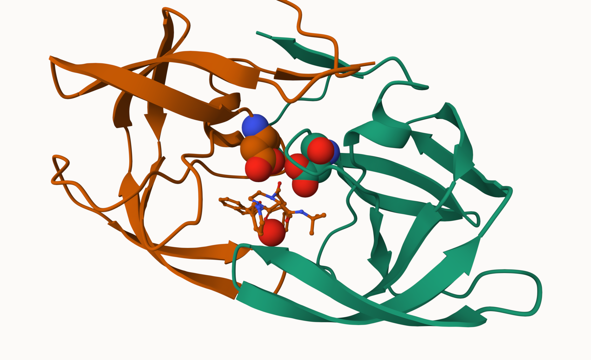
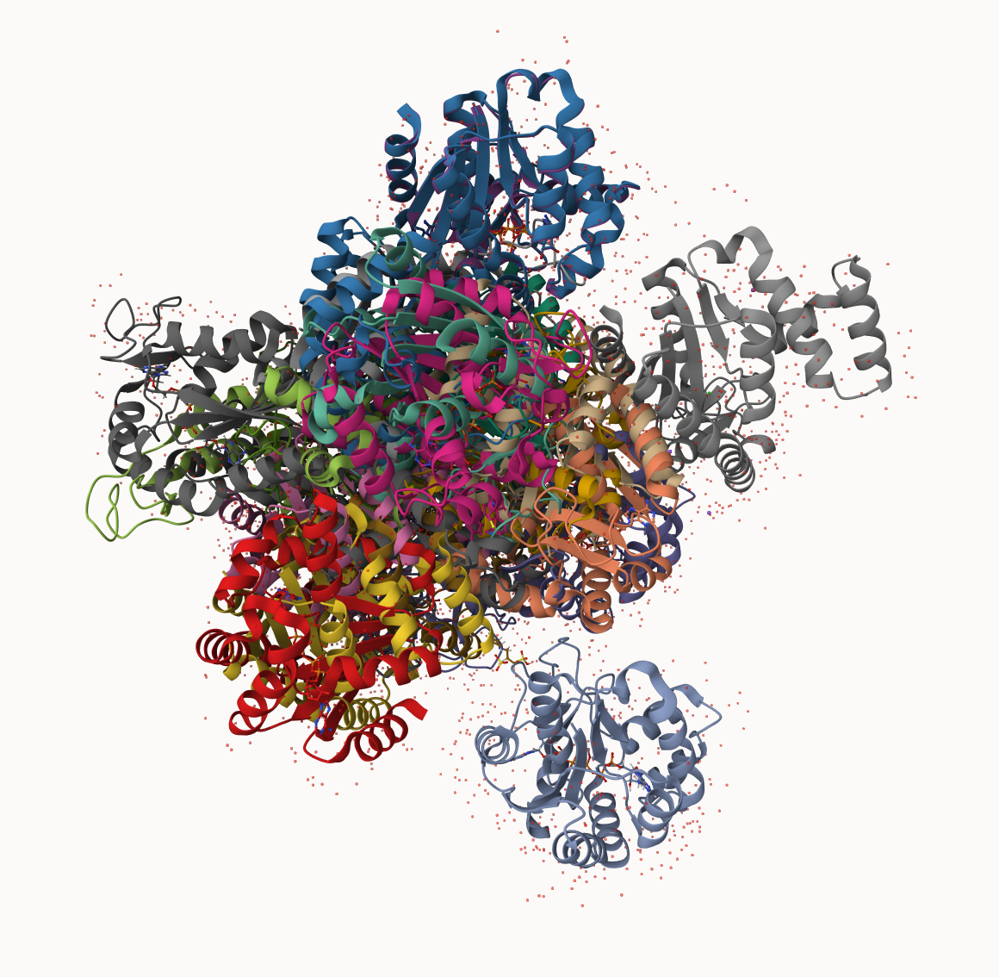

# Structural bioinformatics pt.1
Jacob Hizon A17776679

- [PDB Statistics](#pdb-statistics)
- [Visualizing the HIV-1 protease
  structure](#visualizing-the-hiv-1-protease-structure)
- [Introduction to Bio3D in R / Bio3D package for structural
  bioinformatics](#introduction-to-bio3d-in-r--bio3d-package-for-structural-bioinformatics)
- [Predicting functional motions of a single
  structure](#predicting-functional-motions-of-a-single-structure)
- [Comparative analysis with PCA](#comparative-analysis-with-pca)
- [PCA](#pca)

## PDB Statistics

The Protein Data Bank (PDB) is the main repository of biomolecular
structures. Let’s see what it contains.

> Q1: What percentage of structures in the PDB are solved by X-Ray and
> Electron Microscopy.

The comma in these numbers leads to the numbers here being read as
character.

``` r
library(readr)
stats <- read_csv("Data Export Summary.csv")
```

    Rows: 6 Columns: 9
    ── Column specification ────────────────────────────────────────────────────────
    Delimiter: ","
    chr (1): Molecular Type
    dbl (4): Integrative, Multiple methods, Neutron, Other
    num (4): X-ray, EM, NMR, Total

    ℹ Use `spec()` to retrieve the full column specification for this data.
    ℹ Specify the column types or set `show_col_types = FALSE` to quiet this message.

``` r
stats
```

    # A tibble: 6 × 9
      `Molecular Type`    `X-ray`    EM   NMR Integrative `Multiple methods` Neutron
      <chr>                 <dbl> <dbl> <dbl>       <dbl>              <dbl>   <dbl>
    1 Protein (only)       178795 21825 12773         343                226      84
    2 Protein/Oligosacch…   10363  3564    34           8                 11       1
    3 Protein/NA             9106  6335   287          24                  7       0
    4 Nucleic acid (only)    3132   221  1566           3                 15       3
    5 Other                   175    25    33           4                  0       0
    6 Oligosaccharide (o…      11     0     6           0                  1       0
    # ℹ 2 more variables: Other <dbl>, Total <dbl>

``` r
n.xray <-sum(stats$`X-ray`)


n.total<- sum(stats$Total)

n.xray/n.total
```

    [1] 0.8095077

``` r
n.em <- sum(stats$EM)
n.em/n.total
```

    [1] 0.1283843

> Q2: What proportion of structures in the PDB are protein?

``` r
stats[1, 9]/n.total
```

          Total
    1 0.8596889

85.6%

> Q3: Type HIV in the PDB website search box on the home page and
> determine how many HIV-1 protease structures are in the current PDB?

There are 38 structures of the HIV-1 protease in the current PDB

## Visualizing the HIV-1 protease structure

> Q4: Water molecules normally have 3 atoms. Why do we see just one atom
> per water molecule in this structure?

> Q5: There is a critical “conserved” water molecule in the binding
> site. Can you identify this water molecule? What residue number does
> this water molecule have

We can use Molstar viewer online: https://molstar.org/viewer/


> Q6: Generate and save a figure clearly showing the two distinct chains
> of HIV-protease along with the ligand. You might also consider showing
> the catalytic residues ASP 25 in each chain and the critical water (we
> recommend “Ball & Stick” for these side-chains). Add this figure to
> your Quarto document.

A new clean image showing the catalytic ASP25 amino acids in both chains
of the HIV-PR dimer along with the inhibitor and all important active
site water.



## Introduction to Bio3D in R / Bio3D package for structural bioinformatics

``` r
library(bio3d)
pdb <- read.pdb("1hsg")
```

      Note: Accessing on-line PDB file

``` r
pdb
```


     Call:  read.pdb(file = "1hsg")

       Total Models#: 1
         Total Atoms#: 1686,  XYZs#: 5058  Chains#: 2  (values: A B)

         Protein Atoms#: 1514  (residues/Calpha atoms#: 198)
         Nucleic acid Atoms#: 0  (residues/phosphate atoms#: 0)

         Non-protein/nucleic Atoms#: 172  (residues: 128)
         Non-protein/nucleic resid values: [ HOH (127), MK1 (1) ]

       Protein sequence:
          PQITLWQRPLVTIKIGGQLKEALLDTGADDTVLEEMSLPGRWKPKMIGGIGGFIKVRQYD
          QILIEICGHKAIGTVLVGPTPVNIIGRNLLTQIGCTLNFPQITLWQRPLVTIKIGGQLKE
          ALLDTGADDTVLEEMSLPGRWKPKMIGGIGGFIKVRQYDQILIEICGHKAIGTVLVGPTP
          VNIIGRNLLTQIGCTLNF

    + attr: atom, xyz, seqres, helix, sheet,
            calpha, remark, call

> Q7: How many amino acid residues are there in this pdb object?

198. 

> Q8: Name one of the two non-protein residues?

MK1.

> Q9: How many protein chains are in this structure?

There are 2 protein chains.

``` r
head(pdb$atom)
```

      type eleno elety  alt resid chain resno insert      x      y     z o     b
    1 ATOM     1     N <NA>   PRO     A     1   <NA> 29.361 39.686 5.862 1 38.10
    2 ATOM     2    CA <NA>   PRO     A     1   <NA> 30.307 38.663 5.319 1 40.62
    3 ATOM     3     C <NA>   PRO     A     1   <NA> 29.760 38.071 4.022 1 42.64
    4 ATOM     4     O <NA>   PRO     A     1   <NA> 28.600 38.302 3.676 1 43.40
    5 ATOM     5    CB <NA>   PRO     A     1   <NA> 30.508 37.541 6.342 1 37.87
    6 ATOM     6    CG <NA>   PRO     A     1   <NA> 29.296 37.591 7.162 1 38.40
      segid elesy charge
    1  <NA>     N   <NA>
    2  <NA>     C   <NA>
    3  <NA>     C   <NA>
    4  <NA>     O   <NA>
    5  <NA>     C   <NA>
    6  <NA>     C   <NA>

``` r
attributes(pdb)
```

    $names
    [1] "atom"   "xyz"    "seqres" "helix"  "sheet"  "calpha" "remark" "call"  

    $class
    [1] "pdb" "sse"

``` r
#library(bio3dview)
#view.pdb(pdb)
```

``` r
# Select the important ASP 25 residue
#sele <- atom.select(pdb, resno=25)

# and highlight them in spacefill representation
#view.pdb(pdb, cols=c("navy","teal"), 
        # highlight = sele,
        # highlight.style = "spacefill")
```

## Predicting functional motions of a single structure

Read and ADK structure from the PDB database:

``` r
adk <- read.pdb("6s36")
```

      Note: Accessing on-line PDB file
       PDB has ALT records, taking A only, rm.alt=TRUE

``` r
adk
```


     Call:  read.pdb(file = "6s36")

       Total Models#: 1
         Total Atoms#: 1898,  XYZs#: 5694  Chains#: 1  (values: A)

         Protein Atoms#: 1654  (residues/Calpha atoms#: 214)
         Nucleic acid Atoms#: 0  (residues/phosphate atoms#: 0)

         Non-protein/nucleic Atoms#: 244  (residues: 244)
         Non-protein/nucleic resid values: [ CL (3), HOH (238), MG (2), NA (1) ]

       Protein sequence:
          MRIILLGAPGAGKGTQAQFIMEKYGIPQISTGDMLRAAVKSGSELGKQAKDIMDAGKLVT
          DELVIALVKERIAQEDCRNGFLLDGFPRTIPQADAMKEAGINVDYVLEFDVPDELIVDKI
          VGRRVHAPSGRVYHVKFNPPKVEGKDDVTGEELTTRKDDQEETVRKRLVEYHQMTAPLIG
          YYSKEAEAGNTKYAKVDGTKPVAEVRADLEKILG

    + attr: atom, xyz, seqres, helix, sheet,
            calpha, remark, call

``` r
m <- nma(adk)
```

     Building Hessian...        Done in 0.011 seconds.
     Diagonalizing Hessian...   Done in 0.062 seconds.

``` r
plot(m)
```


Write out results as a trajectory/movie of predicted motions:

``` r
mktrj(m, file="adk_m7.pdb")
```

## Comparative analysis with PCA

First step find an ADK sequence:

``` r
library(bio3d)
id <- "1ake_A" ## change this to run a different analysis 
aa <- get.seq( id )
```

    Warning in get.seq(id): Removing existing file: seqs.fasta

    Fetching... Please wait. Done.

``` r
aa
```

                 1        .         .         .         .         .         60 
    pdb|1AKE|A   MRIILLGAPGAGKGTQAQFIMEKYGIPQISTGDMLRAAVKSGSELGKQAKDIMDAGKLVT
                 1        .         .         .         .         .         60 

                61        .         .         .         .         .         120 
    pdb|1AKE|A   DELVIALVKERIAQEDCRNGFLLDGFPRTIPQADAMKEAGINVDYVLEFDVPDELIVDRI
                61        .         .         .         .         .         120 

               121        .         .         .         .         .         180 
    pdb|1AKE|A   VGRRVHAPSGRVYHVKFNPPKVEGKDDVTGEELTTRKDDQEETVRKRLVEYHQMTAPLIG
               121        .         .         .         .         .         180 

               181        .         .         .   214 
    pdb|1AKE|A   YYSKEAEAGNTKYAKVDGTKPVAEVRADLEKILG
               181        .         .         .   214 

    Call:
      read.fasta(file = outfile)

    Class:
      fasta

    Alignment dimensions:
      1 sequence rows; 214 position columns (214 non-gap, 0 gap) 

    + attr: id, ali, call

Next step, is search the PDB database for all related entries:

``` r
#blast <- blast.pdb(aa)
#hits <- plot(blast)
```

All the BLAST results

``` r
#head(blast$hit.tbl)
```

The “top hits” are in the `hits` object. Now we can download these to
our computer. Put these in our sub-folder (directory) called “pdbs” and
use gzip to spped things up.

``` r
# Download releated PDB files
#files <- get.pdb(hits$pdb.id, path="pdbs", split=TRUE, gzip=TRUE)
```

These look like a hot mess



Next we will use the pdbaln() function to align and also optionally fit
(i.e. superpose) the identified PDB structures.

This requires a BioConductor package called “msa” that we need to
install. First we install BiocManager. Then we use
`BiocManager::install("msa")`

``` r
# Align releated PDBs
#pdbs <- pdbaln(files, fit = TRUE, exefile="msa")
```

Have a peak at this new “alignment object” `pdbs`

``` r
#pdbs
```

We could view these in R with **bio3dview** `view.pdbs()` function

``` r
#library(bio3dview)
#view.pdbs(pdbs, colorScheme = "residue")
```

## PCA

We can run PCA on our `pdbs` object using the `pca()` function from
**bio3d**:

``` r
# Perform PCA
#pc.xray <- pca(pdbs)
#plot(pc.xray)
```

``` r
#plot(pc.xray, 1:2)
```

We can make a helpful a visulization of the major conformational
differences (i.e. large scale structure change) captured by our PCA
analysis with the `mktrj()` function.

``` r
#pc1 <- mktrj(pc.xray, file="pca.pdb")
```

Let’s see in molstar
