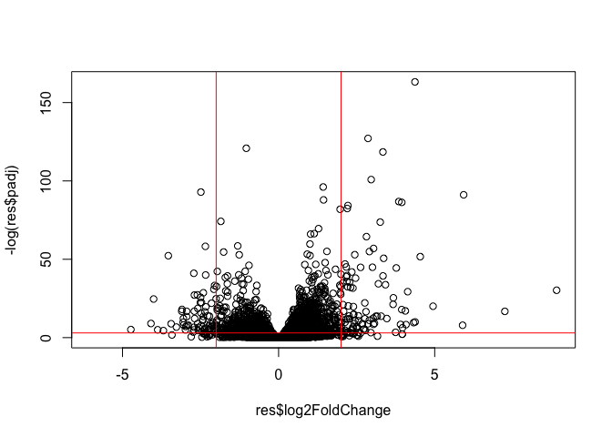

# Class 13: RNASeq with DESeq2
Jacob Hizon A17776679

- [Background](#background)
- [Data Import](#data-import)
- [Differential Gene Expression](#differential-gene-expression)
- [DESeq analysis](#deseq-analysis)
- [Run the DESeq analysis pipline](#run-the-deseq-analysis-pipline)
- [Volcano Plot](#volcano-plot)
- [Adding some color annotation](#adding-some-color-annotation)
- [Save our results](#save-our-results)
- [Add annotation data](#add-annotation-data)
- [Save annotated results to a CSV
  file](#save-annotated-results-to-a-csv-file)
- [Pathway analysis](#pathway-analysis)

## Background

Today we will perform an RNASeq analysis of the effects of a common
steroid on airway cells.

In particular, dexamethasone (hereafter just called “dex”) on different
airway smooth muscle cell lines (ASN cells).

## Data Import

We need two different inputs:

- **countData**: with genes in rows and experiments in columns  
- **colData**: meta data that describes the columns in the contData

``` r
counts <- read.csv("airway_scaledcounts.csv", row.names=1)
metadata <-  read.csv("airway_metadata.csv")
```

A peak at the counts and metadata

``` r
head(counts)
```

                    SRR1039508 SRR1039509 SRR1039512 SRR1039513 SRR1039516
    ENSG00000000003        723        486        904        445       1170
    ENSG00000000005          0          0          0          0          0
    ENSG00000000419        467        523        616        371        582
    ENSG00000000457        347        258        364        237        318
    ENSG00000000460         96         81         73         66        118
    ENSG00000000938          0          0          1          0          2
                    SRR1039517 SRR1039520 SRR1039521
    ENSG00000000003       1097        806        604
    ENSG00000000005          0          0          0
    ENSG00000000419        781        417        509
    ENSG00000000457        447        330        324
    ENSG00000000460         94        102         74
    ENSG00000000938          0          0          0

``` r
metadata
```

              id     dex celltype     geo_id
    1 SRR1039508 control   N61311 GSM1275862
    2 SRR1039509 treated   N61311 GSM1275863
    3 SRR1039512 control  N052611 GSM1275866
    4 SRR1039513 treated  N052611 GSM1275867
    5 SRR1039516 control  N080611 GSM1275870
    6 SRR1039517 treated  N080611 GSM1275871
    7 SRR1039520 control  N061011 GSM1275874
    8 SRR1039521 treated  N061011 GSM1275875

> Q1. How many genes are in this dataset?

``` r
nrow(counts)
```

    [1] 38694

> Q2. How many ‘control’ cell lines do we have?

``` r
table(metadata$dex)
```


    control treated 
          4       4 

## Differential Gene Expression

We have 4 replicate drug treated and control (no drug)
columns/experiments in our `counts` object.

We want one “mean” value for each gene (rows) in “treated” (drug) and
one mean value for each gene in “control” cols.

Step 1. Find all “control” columns

``` r
control.inds <- metadata$dex == "control"
```

Step 2. Extract these columns to a new object called `control.counts`

``` r
control.counts <- counts[, control.inds]
```

Step 3. Then calculate the mean for each gene

``` r
control.mean <- rowMeans(control.counts)
```

``` r
#library(dplyr)
#control <- metadata %>% filter(dex=="control")
#control.counts <- counts %>% select(control$id) 
#control.mean <- rowSums(control.counts)/4
#head(control.mean)
```

> Q3. How would you make the above code in either approach more robust?
> Is there a function that could help here?

You can make the code above more robust by using rowMeans() (or ncol().

> Q4. Now do the same thing for the “treated” / Follow the same
> procedure for the treated samples (i.e. calculate the mean per gene
> across drug treated samples and assign to a labeled vector called
> treated.mean)

Step 1. Find all “treated” columns

``` r
treated.inds <- metadata$dex == "treated"
```

Step 2. Extract these columns to a new object called `treated.counts`

``` r
treated.counts <- counts[, treated.inds]
```

Step 3. Then calculate the mean for each gene

``` r
treated.mean <- rowMeans(treated.counts)
```

Put these together for easy book-keeping as `meancounts`

``` r
meancounts <- data.frame(control.mean, treated.mean)
```

> Q6.

`log=` allows us to see the graph log transformed in base R.

A quick plot

``` r
plot(meancounts)
```


Let’s log transform this data:

``` r
plot(meancounts, log="xy")
```

    Warning in xy.coords(x, y, xlabel, ylabel, log): 15032 x values <= 0 omitted
    from logarithmic plot

    Warning in xy.coords(x, y, xlabel, ylabel, log): 15281 y values <= 0 omitted
    from logarithmic plot


``` r
plot(meancounts[,1],meancounts[,2], xlab="Control", ylab="Treated")
```


> Q5. (b)

Use geomp_point()

``` r
library(ggplot2)

ggplot(meancounts, aes(x = control.mean, y = treated.mean)) +
  geom_point() +
  xlab("control.mean") +
  ylab("treated.mean")
```


**N.B.** We most often use log2 for this type of data as it makes the
interpretation much more straightfoward.

Treated/Control is often called “fold-change”

If there were no change, we would have a log2-fc of zero:

``` r
log2(10/10)
```

    [1] 0

If we had double the transcript around we would have a log2-fc of one

``` r
log2(20/10)
```

    [1] 1

If we had half as much transcript around we would have a log2-fc of -1

``` r
log2(5/10)
```

    [1] -1

> Q. Calculate a log2 fold change value for all our genes and add it as
> a new column to our `meancounts` object

``` r
meancounts$log2fc <- log2(meancounts$treated.mean / 
                            meancounts$control.mean)
head(meancounts)
```

                    control.mean treated.mean      log2fc
    ENSG00000000003       900.75       658.00 -0.45303916
    ENSG00000000005         0.00         0.00         NaN
    ENSG00000000419       520.50       546.00  0.06900279
    ENSG00000000457       339.75       316.50 -0.10226805
    ENSG00000000460        97.25        78.75 -0.30441833
    ENSG00000000938         0.75         0.00        -Inf

``` r
zero.vals <- which(meancounts[,1:2]==0, arr.ind=TRUE)

to.rm <- unique(zero.vals[,1])
mycounts <- meancounts[-to.rm,]
head(mycounts)
```

                    control.mean treated.mean      log2fc
    ENSG00000000003       900.75       658.00 -0.45303916
    ENSG00000000419       520.50       546.00  0.06900279
    ENSG00000000457       339.75       316.50 -0.10226805
    ENSG00000000460        97.25        78.75 -0.30441833
    ENSG00000000971      5219.00      6687.50  0.35769358
    ENSG00000001036      2327.00      1785.75 -0.38194109

> Q7. What is the purpose of the arr.ind argument in the which()
> function call above? Why would we then take the first column of the
> output and need to call the unique() function?

The arr.ind = TRUE argument returns a 2-column matrix of positions—the
row index and column index—for every place where the condition is TRUE
which in this case is where meancounts\[,1:2\] == 0). That tells us
which genes (rows) have zeros and whether it was in control or treated
(columns).

zero.vals\[, 1\] is then used because we only care about which
rows/genes should be removed (a gene should be removed if it has a zero
in either group). Finally,unique() is used because the same gene could
have zeros in both columns. Twice—unique() ensures we only list each row
once before taking them out.

``` r
up.ind <- mycounts$log2fc > 2
down.ind <- mycounts$log2fc < (-2)
```

> Using the up.ind vector above can you determine how many up regulated
> genes we have at the greater than 2 fc level?

``` r
sum(up.ind, na.rm = TRUE)
```

    [1] 250

> Q9. Using the down.ind vector above can you determine how many down
> regulated genes we have at the greater than 2 fc level?

``` r
sum(down.ind, na.rm = TRUE)
```

    [1] 367

> Q10. Do you trust these results? Why or why not?

Not really because this ‘toy’ approach compares raw mean counts between
groups without using an actual statistical model. It does not account
for important considerations such as library size/sequencing depth
differences. There are also many zero-count genes that can distort fold
changes and failure to remove them can cause discrepencies with the
downstream analsyis.

``` r
log2(40/10)
```

    [1] 2

There are some “funky” log2fc values (NaN and -Inf) here that come about
whenever we have 0 mean count values. Typically, we would remove these
genes from any further analysis - as we can’t CONT.

## DESeq analysis

Let’s do this analysis with an estimate of statistical significance
using the **DESeq2** package

``` r
library(DESeq2)
```

DESeq (like many bioconductor packages) want it’s input data in a very
specific way.

``` r
dds <- DESeqDataSetFromMatrix(countData = counts,
                       colData = metadata,
                       design = ~dex)
```

    converting counts to integer mode

    Warning in DESeqDataSet(se, design = design, ignoreRank): some variables in
    design formula are characters, converting to factors

## Run the DESeq analysis pipline

The main function `DESeq()`

``` r
dds <- DESeq(dds)
```

    estimating size factors

    estimating dispersions

    gene-wise dispersion estimates

    mean-dispersion relationship

    final dispersion estimates

    fitting model and testing

``` r
res <- results(dds)
head(res)
```

    log2 fold change (MLE): dex treated vs control 
    Wald test p-value: dex treated vs control 
    DataFrame with 6 rows and 6 columns
                      baseMean log2FoldChange     lfcSE      stat    pvalue
                     <numeric>      <numeric> <numeric> <numeric> <numeric>
    ENSG00000000003 747.194195      -0.350703  0.168242 -2.084514 0.0371134
    ENSG00000000005   0.000000             NA        NA        NA        NA
    ENSG00000000419 520.134160       0.206107  0.101042  2.039828 0.0413675
    ENSG00000000457 322.664844       0.024527  0.145134  0.168996 0.8658000
    ENSG00000000460  87.682625      -0.147143  0.256995 -0.572550 0.5669497
    ENSG00000000938   0.319167      -1.732289  3.493601 -0.495846 0.6200029
                         padj
                    <numeric>
    ENSG00000000003  0.163017
    ENSG00000000005        NA
    ENSG00000000419  0.175937
    ENSG00000000457  0.961682
    ENSG00000000460  0.815805
    ENSG00000000938        NA

padj is more stringent and more strict than a normal p-value. This is
important for larger data sets with many genes/data points

## Volcano Plot

This is a main summary results figure from these kinds of studies. It is
a plot of log2 fold-change vs (Adjusted) P-value.

``` r
plot(res$log2FoldChange, 
     res$padj)
```


Again this y-axis needs to be log-transformed. We can flip the y-axis
with a minus sign so it looks like every other volcano plot.

``` r
plot(res$log2FoldChange,
     -log(res$padj))
abline(v=-2, col="red")
abline(v=+2, col="red")
abline(h=-log(0.05), col="red")
```



## Adding some color annotation

Let’s start with a default base color “gray”

``` r
# Custom colors
mycols <- rep("gray", nrow(res))
mycols[res$log2FoldChange > 2] <- "blue"
mycols[res$log2FoldChange < -2] <- "darkgreen"
mycols[res$padj >=0.05] <- "gray"

# Volcano plot 
plot(res$log2FoldChange,
     -log(res$padj),
     col=mycols)
#cut off dashed lines
abline(v=-2, lty = 2)
abline(v=+2, lty = 2)
abline(h=-log(0.05), lty = 2)
```


> Q. Make a ggplot version of this plot

``` r
library(ggplot2)
#ggplot(res, aes(res$log2FoldChange,-log(res$padj))) +
 # geom_point(colour = mycols) +
 # labs (x="Log2 Fold-change",
    #    y= "-log Adjusted P-value") +
#  geom_vline(xintercept = c(-2,2)) +
 # geom_vline(yintercept=-log(0.05)) +
# theme_bw()
```

## Save our results

Write a CSV file

``` r
write.csv(res, file="results.csv")
```

## Add annotation data

We need to add missing annotation data to our main `res` results object.
This includes the common gene “symbol”

``` r
head(res)
```

    log2 fold change (MLE): dex treated vs control 
    Wald test p-value: dex treated vs control 
    DataFrame with 6 rows and 6 columns
                      baseMean log2FoldChange     lfcSE      stat    pvalue
                     <numeric>      <numeric> <numeric> <numeric> <numeric>
    ENSG00000000003 747.194195      -0.350703  0.168242 -2.084514 0.0371134
    ENSG00000000005   0.000000             NA        NA        NA        NA
    ENSG00000000419 520.134160       0.206107  0.101042  2.039828 0.0413675
    ENSG00000000457 322.664844       0.024527  0.145134  0.168996 0.8658000
    ENSG00000000460  87.682625      -0.147143  0.256995 -0.572550 0.5669497
    ENSG00000000938   0.319167      -1.732289  3.493601 -0.495846 0.6200029
                         padj
                    <numeric>
    ENSG00000000003  0.163017
    ENSG00000000005        NA
    ENSG00000000419  0.175937
    ENSG00000000457  0.961682
    ENSG00000000460  0.815805
    ENSG00000000938        NA

We will use R and bioconductor to do this “ID mapping”

``` r
library("AnnotationDbi")
library("org.Hs.eg.db")
```

Let’s see what databases we can use for translation/mapping

``` r
columns(org.Hs.eg.db)
```

     [1] "ACCNUM"       "ALIAS"        "ENSEMBL"      "ENSEMBLPROT"  "ENSEMBLTRANS"
     [6] "ENTREZID"     "ENZYME"       "EVIDENCE"     "EVIDENCEALL"  "GENENAME"    
    [11] "GENETYPE"     "GO"           "GOALL"        "IPI"          "MAP"         
    [16] "OMIM"         "ONTOLOGY"     "ONTOLOGYALL"  "PATH"         "PFAM"        
    [21] "PMID"         "PROSITE"      "REFSEQ"       "SYMBOL"       "UCSCKG"      
    [26] "UNIPROT"     

We can use the `mapIds()` function to now “translate” between any of
these databases.

``` r
res$symbol <- mapIds(org.Hs.eg.db,
                    keys=row.names(res),      # Our genenames
                    keytype="ENSEMBL",        # The format of our genenames
                    column="SYMBOL",)         # The new format we want to add
```

    'select()' returned 1:many mapping between keys and columns

> Q11. Run the mapIds() function two more times to add the Entrez ID and
> UniProt accession and GENENAME as new columns called
> res$entrez, res$uniprot and res\$genename.

> Q. Also add “ENTREZID”, “GENENAME”

``` r
head(res)
```

    log2 fold change (MLE): dex treated vs control 
    Wald test p-value: dex treated vs control 
    DataFrame with 6 rows and 7 columns
                      baseMean log2FoldChange     lfcSE      stat    pvalue
                     <numeric>      <numeric> <numeric> <numeric> <numeric>
    ENSG00000000003 747.194195      -0.350703  0.168242 -2.084514 0.0371134
    ENSG00000000005   0.000000             NA        NA        NA        NA
    ENSG00000000419 520.134160       0.206107  0.101042  2.039828 0.0413675
    ENSG00000000457 322.664844       0.024527  0.145134  0.168996 0.8658000
    ENSG00000000460  87.682625      -0.147143  0.256995 -0.572550 0.5669497
    ENSG00000000938   0.319167      -1.732289  3.493601 -0.495846 0.6200029
                         padj      symbol
                    <numeric> <character>
    ENSG00000000003  0.163017      TSPAN6
    ENSG00000000005        NA        TNMD
    ENSG00000000419  0.175937        DPM1
    ENSG00000000457  0.961682       SCYL3
    ENSG00000000460  0.815805       FIRRM
    ENSG00000000938        NA         FGR

``` r
res$entrez <- mapIds(org.Hs.eg.db,
                    keys=row.names(res),      # Our genenames
                    keytype="ENSEMBL",        # The format of our genenames
                    column="ENTREZID",)         # The new format we want to add
```

    'select()' returned 1:many mapping between keys and columns

``` r
res$genename <- mapIds(org.Hs.eg.db,
                    keys=row.names(res),      # Our genenames
                    keytype="ENSEMBL",        # The format of our genenames
                    column="GENENAME",)         # The new format we want to add
```

    'select()' returned 1:many mapping between keys and columns

``` r
head(res)
```

    log2 fold change (MLE): dex treated vs control 
    Wald test p-value: dex treated vs control 
    DataFrame with 6 rows and 9 columns
                      baseMean log2FoldChange     lfcSE      stat    pvalue
                     <numeric>      <numeric> <numeric> <numeric> <numeric>
    ENSG00000000003 747.194195      -0.350703  0.168242 -2.084514 0.0371134
    ENSG00000000005   0.000000             NA        NA        NA        NA
    ENSG00000000419 520.134160       0.206107  0.101042  2.039828 0.0413675
    ENSG00000000457 322.664844       0.024527  0.145134  0.168996 0.8658000
    ENSG00000000460  87.682625      -0.147143  0.256995 -0.572550 0.5669497
    ENSG00000000938   0.319167      -1.732289  3.493601 -0.495846 0.6200029
                         padj      symbol      entrez               genename
                    <numeric> <character> <character>            <character>
    ENSG00000000003  0.163017      TSPAN6        7105          tetraspanin 6
    ENSG00000000005        NA        TNMD       64102            tenomodulin
    ENSG00000000419  0.175937        DPM1        8813 dolichyl-phosphate m..
    ENSG00000000457  0.961682       SCYL3       57147 SCY1 like pseudokina..
    ENSG00000000460  0.815805       FIRRM       55732 FIGNL1 interacting r..
    ENSG00000000938        NA         FGR        2268 FGR proto-oncogene, ..

## Save annotated results to a CSV file

``` r
write.csv(res, file = "results_annotated.csv")
```

## Pathway analysis

What known biological pathways do our differential expressed genes genes
overlap (i.e. play a role in)?

There’s lots of bioconductor packages to do this type of analysis.

We will use one of the oldest called **gage** along with **pathviewer**
to render nice pics of the pathways we find.

We can install these with the command:

`BiocManager::install( c("pathview", "gage", "gageData") )`

``` r
library(pathview)
library(gage)
library(gageData)
```

Have a peak what is in `gageData`

``` r
# Examine the first 2 pathways in this kegg set for humans
data(kegg.sets.hs)
head(kegg.sets.hs, 2)
```

    $`hsa00232 Caffeine metabolism`
    [1] "10"   "1544" "1548" "1549" "1553" "7498" "9"   

    $`hsa00983 Drug metabolism - other enzymes`
     [1] "10"     "1066"   "10720"  "10941"  "151531" "1548"   "1549"   "1551"  
     [9] "1553"   "1576"   "1577"   "1806"   "1807"   "1890"   "221223" "2990"  
    [17] "3251"   "3614"   "3615"   "3704"   "51733"  "54490"  "54575"  "54576" 
    [25] "54577"  "54578"  "54579"  "54600"  "54657"  "54658"  "54659"  "54963" 
    [33] "574537" "64816"  "7083"   "7084"   "7172"   "7363"   "7364"   "7365"  
    [41] "7366"   "7367"   "7371"   "7372"   "7378"   "7498"   "79799"  "83549" 
    [49] "8824"   "8833"   "9"      "978"   

The main `gage()`function that does the actual work wants a simple
vector as input.

``` r
foldchanges <- res$log2FoldChange
names(foldchanges) <- res$symbol
head(foldchanges)
```

         TSPAN6        TNMD        DPM1       SCYL3       FIRRM         FGR 
    -0.35070296          NA  0.20610728  0.02452701 -0.14714263 -1.73228897 

The KEGG database uses ENTREZ ids so we need to provide these in our
input vector for **gage**:

``` r
names(foldchanges) <- res$entrez
```

``` r
# Get the results
keggres = gage(foldchanges, gsets=kegg.sets.hs)
```

What is in the output object `keggres`

``` r
attributes(keggres)
```

    $names
    [1] "greater" "less"    "stats"  

``` r
# Look at the first three down (less) pathways
head(keggres$less, 3)
```

                                          p.geomean stat.mean        p.val
    hsa05332 Graft-versus-host disease 0.0004250607 -3.473335 0.0004250607
    hsa04940 Type I diabetes mellitus  0.0017820379 -3.002350 0.0017820379
    hsa05310 Asthma                    0.0020046180 -3.009045 0.0020046180
                                            q.val set.size         exp1
    hsa05332 Graft-versus-host disease 0.09053792       40 0.0004250607
    hsa04940 Type I diabetes mellitus  0.14232788       42 0.0017820379
    hsa05310 Asthma                    0.14232788       29 0.0020046180

We can use the **pathview** function to render a figure of any of these
pathways along with our DEGs

Let’s see the hsa05310 Asthma pathway with our DEGs colored up:

``` r
pathview(gene.data=foldchanges, pathway.id="hsa05310")
```

    'select()' returned 1:1 mapping between keys and columns

    Info: Working in directory /Users/jacobhizon/Desktop/BIMM143/bimm143_github/class13

    Info: Writing image file hsa05310.pathview.png


> Q. Can you render and insert here the pathway for Type I diabetes and
> Graft-versus host disease?

``` r
pathview(gene.data=foldchanges, pathway.id="hsa05332")
```

    'select()' returned 1:1 mapping between keys and columns

    Info: Working in directory /Users/jacobhizon/Desktop/BIMM143/bimm143_github/class13

    Info: Writing image file hsa05332.pathview.png


``` r
pathview(gene.data=foldchanges, pathway.id="hsa04940")
```

    'select()' returned 1:1 mapping between keys and columns

    Info: Working in directory /Users/jacobhizon/Desktop/BIMM143/bimm143_github/class13

    Info: Writing image file hsa04940.pathview.png


