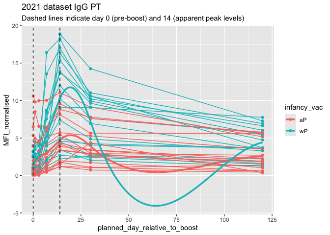

# Pertussis and the CMI-PB project (Class 18)
Jacob Hizon A17776679

# Background

Pertussis (whooping cough) is a common lung infection caused by the
bacteria B. pertussis. It can infect anyone but it is most deadly for
infants (under 1 year of age).

## CDC tracking data

The CDC tracks the number of Pertussis cases:

``` r
cdc
```

        year  cases
    1   1922 107473
    2   1923 164191
    3   1924 165418
    4   1925 152003
    5   1926 202210
    6   1927 181411
    7   1928 161799
    8   1929 197371
    9   1930 166914
    10  1931 172559
    11  1932 215343
    12  1933 179135
    13  1934 265269
    14  1935 180518
    15  1936 147237
    16  1937 214652
    17  1938 227319
    18  1939 103188
    19  1940 183866
    20  1941 222202
    21  1942 191383
    22  1943 191890
    23  1944 109873
    24  1945 133792
    25  1946 109860
    26  1947 156517
    27  1948  74715
    28  1949  69479
    29  1950 120718
    30  1951  68687
    31  1952  45030
    32  1953  37129
    33  1954  60886
    34  1955  62786
    35  1956  31732
    36  1957  28295
    37  1958  32148
    38  1959  40005
    39  1960  14809
    40  1961  11468
    41  1962  17749
    42  1963  17135
    43  1964  13005
    44  1965   6799
    45  1966   7717
    46  1967   9718
    47  1968   4810
    48  1969   3285
    49  1970   4249
    50  1971   3036
    51  1972   3287
    52  1973   1759
    53  1974   2402
    54  1975   1738
    55  1976   1010
    56  1977   2177
    57  1978   2063
    58  1979   1623
    59  1980   1730
    60  1981   1248
    61  1982   1895
    62  1983   2463
    63  1984   2276
    64  1985   3589
    65  1986   4195
    66  1987   2823
    67  1988   3450
    68  1989   4157
    69  1990   4570
    70  1991   2719
    71  1992   4083
    72  1993   6586
    73  1994   4617
    74  1995   5137
    75  1996   7796
    76  1997   6564
    77  1998   7405
    78  1999   7298
    79  2000   7867
    80  2001   7580
    81  2002   9771
    82  2003  11647
    83  2004  25827
    84  2005  25616
    85  2006  15632
    86  2007  10454
    87  2008  13278
    88  2009  16858
    89  2010  27550
    90  2011  18719
    91  2012  48277
    92  2013  28639
    93  2014  32971
    94  2015  20762
    95  2016  17972
    96  2017  18975
    97  2018  15609
    98  2019  18617
    99  2020   6124
    100 2021   2116
    101 2022   3044
    102 2023   7063
    103 2024  22538
    104 2025  21996

> Q.I want a plot of year on the x vs cases on the y.

``` r
library(ggplot2)

ggplot(cdc) + 
  aes(year, cases) +
  geom_point() +
  geom_line()
```


> Q. Add annotation lines for the major milestones of wP vaccination
> roll-out (1946) and the switch to the aP vaccine (1996). What do you
> notice?

We see that there is an increase past 2020.

``` r
ggplot(cdc) + 
  aes(year, cases) +
  geom_point() +
  geom_line() +
  geom_vline(xintercept = 1946, col="blue", lty =2) +
  geom_vline(xintercept = 1996, col="red", lty=2) + 
  geom_vline(xintercept = 2020, col="gray", lty=2)
```


> Q2. Using the ggplot geom_vline() function add lines to your previous
> plot for the 1946 introduction of the wP vaccine and the 1996 switch
> to aP vaccine (see example in the hint below). What do you notice?

I notice a sharp decline in cases from the introduction of the wP
vaccine to the introduction of the 1996 aP vaccine. In 1996 when the new
aP vaccine was introduced, we see cases nearly at zero.

> Q3. Describe what happened after the introduction of the aP vaccine?
> Do you have a possible explanation for the observed trend?

After the introduction of the aP vaccine, there is a steady increase
after 2000 with a sharp peak around ~2010. However, there is again a
steady increase after 2020 due to vaccine hesitancy, antibiotic overuse
and AMR. This can also suggest that there is a waning efficacy of the aP
vaccine is lower than that of the wP vaccine, thus requiring booster
vaccinations for the aP.

# Exploring CMI-PB data

The CMI-PB project link: \< https://www.cmi-pb.org \>

The project’s mission of CMI-PB is to provide the scientific community
with a comprehensive, high-quality and freely accessible resource of
Pertussis booster vaccination.

Basically, make available a large dataset on the immune response to
Pertussis. They use a “booster” vaccination as a proxy for Pertussis
infection.

They make their data available as JSON format API. We can read this into
R with the `read_json()` function from the **jasonlite** package:

``` r
library(jsonlite)
subject <- read_json("https://www.cmi-pb.org/api/v5_1/subject", 
                     simplifyVector = TRUE)
head(subject)
```

      subject_id infancy_vac biological_sex              ethnicity  race
    1          1          wP         Female Not Hispanic or Latino White
    2          2          wP         Female Not Hispanic or Latino White
    3          3          wP         Female                Unknown White
    4          4          wP           Male Not Hispanic or Latino Asian
    5          5          wP           Male Not Hispanic or Latino Asian
    6          6          wP         Female Not Hispanic or Latino White
      year_of_birth date_of_boost      dataset
    1    1986-01-01    2016-09-12 2020_dataset
    2    1968-01-01    2019-01-28 2020_dataset
    3    1983-01-01    2016-10-10 2020_dataset
    4    1988-01-01    2016-08-29 2020_dataset
    5    1991-01-01    2016-08-29 2020_dataset
    6    1988-01-01    2016-10-10 2020_dataset

> Q. How many aP and wP individuals are there in this `subject` table?

``` r
table(subject$infancy_vac)
```


    aP wP 
    87 85 

> Q. How many male/female?

``` r
table(subject$biological_sex)
```


    Female   Male 
       112     60 

> Q. What is the bread down of biological sex and race? Q. Is this
> representative of the US population?

``` r
table(subject$race, subject$biological_sex)
```

                                               
                                                Female Male
      American Indian/Alaska Native                  0    1
      Asian                                         32   12
      Black or African American                      2    3
      More Than One Race                            15    4
      Native Hawaiian or Other Pacific Islander      1    1
      Unknown or Not Reported                       14    7
      White                                         48   32

We can now read more tables from the CMI-PB database

``` r
specimen <- read_json("https://www.cmi-pb.org/api/v5_1/specimen", 
                      simplifyVector = TRUE)
head(specimen)
```

      specimen_id subject_id actual_day_relative_to_boost
    1           1          1                           -3
    2           2          1                            1
    3           3          1                            3
    4           4          1                            7
    5           5          1                           11
    6           6          1                           32
      planned_day_relative_to_boost specimen_type visit
    1                             0         Blood     1
    2                             1         Blood     2
    3                             3         Blood     3
    4                             7         Blood     4
    5                            14         Blood     5
    6                            30         Blood     6

``` r
ab_titer <- read_json("https://www.cmi-pb.org/api/v5_1/plasma_ab_titer", 
                      simplifyVector = TRUE)
```

``` r
head(ab_titer)
```

      specimen_id isotype is_antigen_specific antigen        MFI MFI_normalised
    1           1     IgE               FALSE   Total 1110.21154       2.493425
    2           1     IgE               FALSE   Total 2708.91616       2.493425
    3           1     IgG                TRUE      PT   68.56614       3.736992
    4           1     IgG                TRUE     PRN  332.12718       2.602350
    5           1     IgG                TRUE     FHA 1887.12263      34.050956
    6           1     IgE                TRUE     ACT    0.10000       1.000000
       unit lower_limit_of_detection
    1 UG/ML                 2.096133
    2 IU/ML                29.170000
    3 IU/ML                 0.530000
    4 IU/ML                 6.205949
    5 IU/ML                 4.679535
    6 IU/ML                 2.816431

To make sense of all this data, we need to “join” (a.k.a “merge” or
“link”) all these tables together. Only then will you know that a given
antibody measurement (from the `ab_titer` table) was collected on a
certain data from a certain wP or aP subject (from the `subject` table).

We can use **dplyr** and the `*_join()` family of functions to do this.

``` r
library(dplyr)
```


    Attaching package: 'dplyr'

    The following objects are masked from 'package:stats':

        filter, lag

    The following objects are masked from 'package:base':

        intersect, setdiff, setequal, union

``` r
meta <- inner_join(subject, specimen)
```

    Joining with `by = join_by(subject_id)`

``` r
head(meta)
```

      subject_id infancy_vac biological_sex              ethnicity  race
    1          1          wP         Female Not Hispanic or Latino White
    2          1          wP         Female Not Hispanic or Latino White
    3          1          wP         Female Not Hispanic or Latino White
    4          1          wP         Female Not Hispanic or Latino White
    5          1          wP         Female Not Hispanic or Latino White
    6          1          wP         Female Not Hispanic or Latino White
      year_of_birth date_of_boost      dataset specimen_id
    1    1986-01-01    2016-09-12 2020_dataset           1
    2    1986-01-01    2016-09-12 2020_dataset           2
    3    1986-01-01    2016-09-12 2020_dataset           3
    4    1986-01-01    2016-09-12 2020_dataset           4
    5    1986-01-01    2016-09-12 2020_dataset           5
    6    1986-01-01    2016-09-12 2020_dataset           6
      actual_day_relative_to_boost planned_day_relative_to_boost specimen_type
    1                           -3                             0         Blood
    2                            1                             1         Blood
    3                            3                             3         Blood
    4                            7                             7         Blood
    5                           11                            14         Blood
    6                           32                            30         Blood
      visit
    1     1
    2     2
    3     3
    4     4
    5     5
    6     6

Let’s do one more `inner_join()` to join the `ab_titer` with all our
`meta` data.

``` r
abdata <- inner_join(ab_titer, meta)
```

    Joining with `by = join_by(specimen_id)`

``` r
head(abdata)
```

      specimen_id isotype is_antigen_specific antigen        MFI MFI_normalised
    1           1     IgE               FALSE   Total 1110.21154       2.493425
    2           1     IgE               FALSE   Total 2708.91616       2.493425
    3           1     IgG                TRUE      PT   68.56614       3.736992
    4           1     IgG                TRUE     PRN  332.12718       2.602350
    5           1     IgG                TRUE     FHA 1887.12263      34.050956
    6           1     IgE                TRUE     ACT    0.10000       1.000000
       unit lower_limit_of_detection subject_id infancy_vac biological_sex
    1 UG/ML                 2.096133          1          wP         Female
    2 IU/ML                29.170000          1          wP         Female
    3 IU/ML                 0.530000          1          wP         Female
    4 IU/ML                 6.205949          1          wP         Female
    5 IU/ML                 4.679535          1          wP         Female
    6 IU/ML                 2.816431          1          wP         Female
                   ethnicity  race year_of_birth date_of_boost      dataset
    1 Not Hispanic or Latino White    1986-01-01    2016-09-12 2020_dataset
    2 Not Hispanic or Latino White    1986-01-01    2016-09-12 2020_dataset
    3 Not Hispanic or Latino White    1986-01-01    2016-09-12 2020_dataset
    4 Not Hispanic or Latino White    1986-01-01    2016-09-12 2020_dataset
    5 Not Hispanic or Latino White    1986-01-01    2016-09-12 2020_dataset
    6 Not Hispanic or Latino White    1986-01-01    2016-09-12 2020_dataset
      actual_day_relative_to_boost planned_day_relative_to_boost specimen_type
    1                           -3                             0         Blood
    2                           -3                             0         Blood
    3                           -3                             0         Blood
    4                           -3                             0         Blood
    5                           -3                             0         Blood
    6                           -3                             0         Blood
      visit
    1     1
    2     1
    3     1
    4     1
    5     1
    6     1

> Q. How many different Ab “isotypes” values are in this dataset

``` r
table(abdata$isotype)
```


      IgE   IgG  IgG1  IgG2  IgG3  IgG4 
     6698  7265 11993 12000 12000 12000 

> Q 12. What are the different \$dataset values in abdata and what do
> you notice about the number of rows for the most “recent” dataset?

``` r
table(abdata$dataset)
```


    2020_dataset 2021_dataset 2022_dataset 2023_dataset 
           31520         8085         7301        15050 

We see that there is there is double the amount of values in the 2023
dataset then there are in the 2022 dataset.

> Q. How many different “antigen” values are measured

``` r
table(abdata$antigen)
```


        ACT   BETV1      DT   FELD1     FHA  FIM2/3   LOLP1     LOS Measles     OVA 
       1970    1970    6318    1970    6712    6318    1970    1970    1970    6318 
        PD1     PRN      PT     PTM   Total      TT 
       1970    6712    6712    1970     788    6318 

Let’s focus on IgG isotype

Note: there are two ways to write the pipe command; \|\> or %\>%

``` r
igg <-abdata |>
      filter(isotype=="IgG")

head(igg)
```

      specimen_id isotype is_antigen_specific antigen        MFI MFI_normalised
    1           1     IgG                TRUE      PT   68.56614       3.736992
    2           1     IgG                TRUE     PRN  332.12718       2.602350
    3           1     IgG                TRUE     FHA 1887.12263      34.050956
    4          19     IgG                TRUE      PT   20.11607       1.096366
    5          19     IgG                TRUE     PRN  976.67419       7.652635
    6          19     IgG                TRUE     FHA   60.76626       1.096457
       unit lower_limit_of_detection subject_id infancy_vac biological_sex
    1 IU/ML                 0.530000          1          wP         Female
    2 IU/ML                 6.205949          1          wP         Female
    3 IU/ML                 4.679535          1          wP         Female
    4 IU/ML                 0.530000          3          wP         Female
    5 IU/ML                 6.205949          3          wP         Female
    6 IU/ML                 4.679535          3          wP         Female
                   ethnicity  race year_of_birth date_of_boost      dataset
    1 Not Hispanic or Latino White    1986-01-01    2016-09-12 2020_dataset
    2 Not Hispanic or Latino White    1986-01-01    2016-09-12 2020_dataset
    3 Not Hispanic or Latino White    1986-01-01    2016-09-12 2020_dataset
    4                Unknown White    1983-01-01    2016-10-10 2020_dataset
    5                Unknown White    1983-01-01    2016-10-10 2020_dataset
    6                Unknown White    1983-01-01    2016-10-10 2020_dataset
      actual_day_relative_to_boost planned_day_relative_to_boost specimen_type
    1                           -3                             0         Blood
    2                           -3                             0         Blood
    3                           -3                             0         Blood
    4                           -3                             0         Blood
    5                           -3                             0         Blood
    6                           -3                             0         Blood
      visit
    1     1
    2     1
    3     1
    4     1
    5     1
    6     1

Make a plot of `MFI_normalised` values for all `antigen` values.

``` r
ggplot(igg) +
  aes(MFI_normalised, antigen) +
  geom_boxplot()
```


The antigens “PT”, “FIM2/3” and “FHA” appear to have the widest range
because the aP vaccines is composed of these antibodies.

> Q. IS there a difference for these responses between aP and wP
> individuals.

``` r
ggplot(igg) +
  aes(MFI_normalised, antigen, col=infancy_vac) +
  geom_boxplot()
```


``` r
ggplot(igg) +
  aes(MFI_normalised, antigen) +
  geom_boxplot() +
  facet_wrap(~infancy_vac)
```


> Q. 13 Complete the following code to make a summary boxplot of Ab
> titer levels (MFI) for all antigens:

``` r
ggplot(igg) +
  aes(MFI_normalised, antigen) +
  geom_boxplot() +
  xlim(0,75) +
  facet_wrap(vars(visit), nrow=2)
```

    Warning: Removed 5 rows containing non-finite outside the scale range
    (`stat_boxplot()`).


> Q. 14 What antigens show differences in the level of IgG antibody
> titers recognizing them over time? Why these and not others?

The antigens that show the most obvious differences in IgG antibody
levels over time are FIM2/3 and FHA. FIM2/3, which are the antigen
components the whooping cough bacterium, recognition increases over time
due to a boosted antigen-specific IgG response after vaccination.

> Q. Is there a difference with time (i.e. before booster shot vs after
> booster shot)

``` r
ggplot(igg) +
  aes(MFI_normalised, antigen, col=infancy_vac) +
  geom_boxplot() +
  facet_wrap(~visit)
```


Let’s look specifically at 2021 IgA in wP and aP

``` r
## filter to 2021 dataset, IgG and PT only 
abdata.21 <- abdata %>% filter(dataset == "2021_dataset")

abdata.21 %>% 
  filter(isotype == "IgG",  antigen == "PT") %>%
  ggplot() +
    aes(x=planned_day_relative_to_boost,
        y=MFI_normalised,
        col=infancy_vac,
        group=subject_id) +
    geom_point() +
    geom_line() +
     geom_smooth(
    aes(group = infancy_vac, col = infancy_vac),
    method = "loess",  # or method = "lm"
    se = FALSE,
    linewidth = 1.2
  )+
    geom_vline(xintercept=0, linetype="dashed") +
    geom_vline(xintercept=14, linetype="dashed") +
  labs(title="2021 dataset IgG PT",
       subtitle = "Dashed lines indicate day 0 (pre-boost) and 14 (apparent peak levels)")
```

    `geom_smooth()` using formula = 'y ~ x'



ADD A TREND LINE FOR WP and AP seperately
